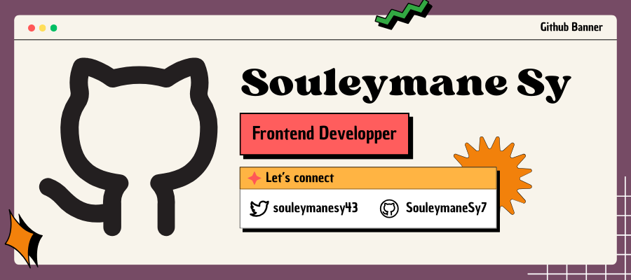
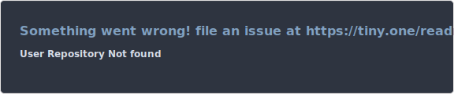
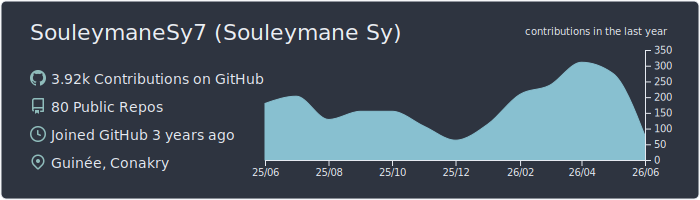
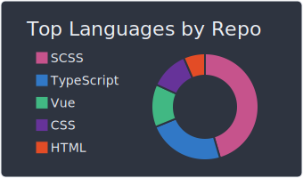
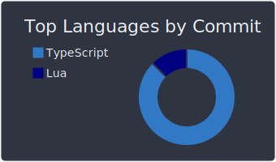
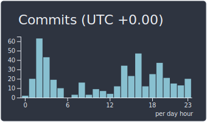

<!-- ============================== -->
<!-- GITHUB PROFILE README -->
<!-- Souleymane Sy (@SouleymaneSy7) -->
<!-- ============================== -->

<!-- Section 1: Custom Banner -->
<p align="center">
  
</p>

<!-- Section 2: Social Badges -->
<p align="center">
  <a href="https://komarev.com/ghpvc/?username=souleymanesy7" target="_blank">
    
  </a>
</p>

<p align="center">
  <a href="https://github.com/SouleymaneSy7?tab=followers" title="GitHub Followers">
    
  </a>
  <a href="https://github.com/SouleymaneSy7?tab=stars" title="GitHub Stars">
    
  </a>
  <a href="mailto:souleymanesycodes@gmail.com" title="Email Me">
    
  </a>
</p>

<!-- Section 3: Typing Animation Intro -->
<p align="center">
  
</p>

---

<!-- Section 4: Hero Introduction -->

## 🌍 About Me

Frontend developer from Coyah, Guinea. Self-taught since 2022.

I started with YouTube tutorials, Grafikart, Traversy Media, Kevin Powell, learning HTML, then CSS, then spending about eight months getting comfortable with JavaScript. No bootcamp, no CS degree. Just docs, replayed videos, and a lot of broken code that eventually stopped being broken.

Living in Guinea makes some things harder than they should be. Power cuts mid-session, internet that drops during downloads, no credit card for paid courses. I found ways around most of it. Some of the best things I've learned came from courses I couldn't afford to buy.

In 2024, I entered Enzo Ustariz's web dev contest, not for the first time but for the first time seriously. Two weeks building a tourism site for Conakry. Came third. That felt like proof the approach was working.

A few months later: a remote frontend internship at DevelopersHub Corporation. Six weeks, real tasks, real code review, exceptional distinction certificate on exit.

Currently working with React, Next.js, TypeScript, and GSAP. Learning Node.js. Open to remote work.

---

<!-- Section 5: Achievements & Highlights -->

## 🏆 Achievements & Highlights

| Achievement                   | Details                                                                                                                                                                     |
| ----------------------------- | --------------------------------------------------------------------------------------------------------------------------------------------------------------------------- |
| 🥉 **Contest Winner**         | 3rd place — Enzo Ustariz Web Development Contest 2024                                                                                                                       |
| 💼 **Remote Internship**      | DevelopersHub Corporation — Exceptional Distinction certificate                                                                                                             |
| 📦 **90+ Projects on GitHub** | Challenges, clones, and original work built across 3 years                                                                                                                  |
| ⭐ **108 GitHub Stars**       | Spread across 90 public repositories                                                                                                                                        |
| 👥 **430+ Followers**         | —                                                                                                                                                                           |
| 🌍 **Self-Taught Since 2022** | HTML → CSS → JS → Vue.js → TypeScript → React → Next.js, no formal CS education                                                                                             |
| 🎓 **Notable Courses**        | Joy of React (Josh Comeau), TypeScript (AcademindPro, Mosh Hamedani), Next.js (FrontendMasters, Jack Herrington), GSAP (Creative Coding Club), Framer Motion (Frontend.fyi) |

---

<!-- Section 6: Detailed Profile -->

## 👨🏾‍💻 Full Profile

<details>
<summary>📄 Click to expand full profile details</summary>
<br>

```json
{
  "first_name": "Souleymane",
  "last_name": "Sy",
  "title": "Frontend Web Developer",
  "location": "Conakry, Guinea - Africa",
  "pronouns": ["He", "Him"],
  "education": {
    "path": "Self-taught",
    "since": 2022
  },
  "technologies": {
    "front_end": [
      "HTML5",
      "CSS3",
      "JavaScript (ES6+)",
      "TypeScript",
      "React",
      "Next.js",
      "Vue.js",
      "GSAP",
      "Framer Motion",
      "Sass/SCSS",
      "Tailwind CSS",
      "Markdown",
      "MDX"
    ],
    "tools": [
      "Git",
      "GitHub",
      "VS Code",
      "Neovim",
      "Vim",
      "LazyVim",
      "Figma",
      "Vercel",
      "Pop!_OS",
      "Arch Linux",
      "Hyprland"
    ]
  },
  "ask_me_about": [
    "Web Development",
    "Frontend Frameworks",
    "UI/UX Design",
    "Creative Coding",
    "Linux & Open Source",
    "Tech Trends"
  ],
  "currently_learning": [
    "Node.js & Backend Development",
    "Creative Coding & Advanced Animations",
    "Full-Stack Development"
  ],
  "spoken_languages": ["French (Native)", "English (Professional Proficiency)"],
  "contact": {
    "email": "souleymanesycodes@gmail.com",
    "linkedin": "https://www.linkedin.com/in/souleymanesy7",
    "twitter/X": "https://x.com/souleymanesy43",
    "frontend_mentor": "https://www.frontendmentor.io/profile/SouleymaneSy7",
    "dev_challenges": "https://devchallenges.io/profile/534cd213-3165-4c16-bdcf-058e1f468da0"
  },
  "availability": {
    "status": "Open to opportunities",
    "types": [
      "Remote Full-time",
      "Freelance Projects",
      "Contract Work",
      "Collaborations"
    ]
  }
}
```

</details>

---

<!-- Section 7: Tech Stack Visual -->

## 🛠️ Tech Stack

<details>
<summary>📄 Click to expand Tech Stack details</summary>
<br>

### Frontend Frameworks & Libraries


### Styling & Design


### Animation & Motion


### Tools & Platforms


### Code Editors


### Operating Systems & Environment


</details>

---

<!-- Section 8: Featured Projects -->

## 🎯 Featured Projects

<table>
  <tr>
    <td width="50%">
      <h3 align="center">Terminal Portfolio Website</h3>
      <div align="center">  
        <a href="https://github.com/SouleymaneSy7/terminal-portfolio-website" target="_blank">
          
        </a>
        <br>
        <p>
          <a href="https://github.com/SouleymaneSy7/terminal-portfolio-website" target="_blank">
            
          </a>  
          <a href="https://terminal-portfolio-website-xi.vercel.app/" target="_blank">
            
          </a>
        </p>
        <p><strong>Next.js • TypeScript • Tailwind CSS</strong></p>
        <p>Type <code>help</code>, <code>about</code>, or <code>projects</code> and it responds. Command parser written without a library.</p>
      </div>
    </td>
    <td width="50%">
      <h3 align="center">Fyrre Magazine Website</h3>
      <div align="center">  
        <a href="https://github.com/SouleymaneSy7/fyrre-magazine-website" target="_blank">
          
        </a>
        <br>
        <p>
          <a href="https://github.com/SouleymaneSy7/fyrre-magazine-website" target="_blank">
            
          </a>  
          <a href="https://fyrre-magazine-website.netlify.app/" target="_blank">
            
          </a>
        </p>
        <p><strong>Next.js • TypeScript • MDX • Tailwind CSS</strong></p>
        <p>Magazine site with articles, author pages, and podcasts. MDX content pipeline, dynamic routes, 97+ Lighthouse on all metrics.</p>
      </div>
    </td>

  </tr>
  <tr>
    <td width="50%">
      <h3 align="center">Conakry Tourism Website 🏆</h3>
      <div align="center">  
        <a href="https://github.com/SouleymaneSy7/conakry-website-challenge" target="_blank">
          
        </a>
        <br>
        <p>
          <a href="https://github.com/SouleymaneSy7/conakry-website-challenge" target="_blank">
            
          </a>  
          <a href="https://conakry-website-challenge-z4t7.vercel.app/" target="_blank">
            
          </a>
        </p>
        <p><strong>React • TypeScript • Sass • GSAP</strong></p>
        <p>Tourism site for Conakry built in two weeks. GSAP scroll animations. 🥉 3rd place, Enzo Ustariz Contest 2024.</p>
      </div>
    </td>
    <td width="50%">
      <h3 align="center">Dictionary Web App</h3>
      <div align="center">  
        <a href="https://github.com/SouleymaneSy7/dictionary-web-app" target="_blank">
          
        </a>
        <br>
        <p>
          <a href="https://github.com/SouleymaneSy7/dictionary-web-app" target="_blank">
            
          </a>  
          <a href="https://dictionary-web-app-seven-olive.vercel.app/" target="_blank">
            
          </a>
        </p>
        <p><strong>Vue.js • Tailwind CSS • Free Dictionary API</strong></p>
        <p>Word lookup with definitions, phonetics, and audio pronunciation. Dark/light theme toggle.</p>
      </div>
    </td>
  </tr>
</table>

<p align="center">
  <a href="https://github.com/SouleymaneSy7?tab=repositories" target="_blank">
    
  </a>
</p>

---

<!-- Section 9: Activity Graphs -->

## 🚣🏽‍♂️ GitHub Activity

<p align="center">
  <a href="https://github.com/ashutosh00710/github-readme-activity-graph">
    
  </a>
</p>

<!-- Section 10: WakaTime Stats -->

## 📊 Detailed Coding Statistics

<!--START_SECTION:wakatime-readme-stats-->


**🐱 My GitHub Data** 

> 📦 284.7 kB Used in GitHub's Storage 
 > 
> 🏆 1,090 Contributions in the Year 2026
 > 
> 💼 Opted to Hire
 > 
> 📜 90 Public Repositories 
 > 
> 🔑 0 Private Repositories 
 > 
**I'm a Night 🦉** 

```text
🌞 Morning                346 commits         ⣿⣿⣀⣀⣀⣀⣀⣀⣀⣀⣀⣀⣀⣀⣀⣀⣀⣀⣀⣀⣀⣀⣀⣀⣀   09.36 % 
🌆 Daytime                1108 commits        ⣿⣿⣿⣿⣿⣿⣿⣀⣀⣀⣀⣀⣀⣀⣀⣀⣀⣀⣀⣀⣀⣀⣀⣀⣀   29.99 % 
🌃 Evening                1032 commits        ⣿⣿⣿⣿⣿⣿⣿⣀⣀⣀⣀⣀⣀⣀⣀⣀⣀⣀⣀⣀⣀⣀⣀⣀⣀   27.93 % 
🌙 Night                  1209 commits        ⣿⣿⣿⣿⣿⣿⣿⣿⣀⣀⣀⣀⣀⣀⣀⣀⣀⣀⣀⣀⣀⣀⣀⣀⣀   32.72 % 
```
📅 **I'm Most Productive on Wednesday** 

```text
Monday                   553 commits         ⣿⣿⣿⣿⣀⣀⣀⣀⣀⣀⣀⣀⣀⣀⣀⣀⣀⣀⣀⣀⣀⣀⣀⣀⣀   14.97 % 
Tuesday                  624 commits         ⣿⣿⣿⣿⣀⣀⣀⣀⣀⣀⣀⣀⣀⣀⣀⣀⣀⣀⣀⣀⣀⣀⣀⣀⣀   16.89 % 
Wednesday                775 commits         ⣿⣿⣿⣿⣿⣀⣀⣀⣀⣀⣀⣀⣀⣀⣀⣀⣀⣀⣀⣀⣀⣀⣀⣀⣀   20.97 % 
Thursday                 554 commits         ⣿⣿⣿⣿⣀⣀⣀⣀⣀⣀⣀⣀⣀⣀⣀⣀⣀⣀⣀⣀⣀⣀⣀⣀⣀   14.99 % 
Friday                   524 commits         ⣿⣿⣿⣿⣀⣀⣀⣀⣀⣀⣀⣀⣀⣀⣀⣀⣀⣀⣀⣀⣀⣀⣀⣀⣀   14.18 % 
Saturday                 377 commits         ⣿⣿⣿⣀⣀⣀⣀⣀⣀⣀⣀⣀⣀⣀⣀⣀⣀⣀⣀⣀⣀⣀⣀⣀⣀   10.20 % 
Sunday                   288 commits         ⣿⣿⣀⣀⣀⣀⣀⣀⣀⣀⣀⣀⣀⣀⣀⣀⣀⣀⣀⣀⣀⣀⣀⣀⣀   07.79 % 
```


📊 **This Week I Spent My Time On** 

```text
🕑︎ Time Zone: Africa/Conakry

💬 Programming Languages: 
TypeScript               5 hrs 32 mins       ⣿⣿⣿⣿⣿⣿⣿⣿⣿⣿⣿⣿⣿⣿⣿⣀⣀⣀⣀⣀⣀⣀⣀⣀⣀   59.08 % 
Markdown                 2 hrs 3 mins        ⣿⣿⣿⣿⣿⣀⣀⣀⣀⣀⣀⣀⣀⣀⣀⣀⣀⣀⣀⣀⣀⣀⣀⣀⣀   21.97 % 
YAML                     29 mins             ⣿⣀⣀⣀⣀⣀⣀⣀⣀⣀⣀⣀⣀⣀⣀⣀⣀⣀⣀⣀⣀⣀⣀⣀⣀   05.28 % 
Other                    29 mins             ⣿⣀⣀⣀⣀⣀⣀⣀⣀⣀⣀⣀⣀⣀⣀⣀⣀⣀⣀⣀⣀⣀⣀⣀⣀   05.25 % 
JSON                     28 mins             ⣿⣀⣀⣀⣀⣀⣀⣀⣀⣀⣀⣀⣀⣀⣀⣀⣀⣀⣀⣀⣀⣀⣀⣀⣀   05.12 % 

🔥 Editors: 
Neovim                   7 hrs 1 min         ⣿⣿⣿⣿⣿⣿⣿⣿⣿⣿⣿⣿⣿⣿⣿⣿⣿⣿⣿⣀⣀⣀⣀⣀⣀   74.74 % 
OpenCode                 2 hrs 22 mins       ⣿⣿⣿⣿⣿⣿⣀⣀⣀⣀⣀⣀⣀⣀⣀⣀⣀⣀⣀⣀⣀⣀⣀⣀⣀   25.26 % 

🐱‍💻 Projects: 
terminal-portfolio-websit7 hrs 8 mins        ⣿⣿⣿⣿⣿⣿⣿⣿⣿⣿⣿⣿⣿⣿⣿⣿⣿⣿⣿⣀⣀⣀⣀⣀⣀   76.14 % 
SouleymaneSy7            1 hr 31 mins        ⣿⣿⣿⣿⣀⣀⣀⣀⣀⣀⣀⣀⣀⣀⣀⣀⣀⣀⣀⣀⣀⣀⣀⣀⣀   16.16 % 
Unknown Project          35 mins             ⣿⣿⣀⣀⣀⣀⣀⣀⣀⣀⣀⣀⣀⣀⣀⣀⣀⣀⣀⣀⣀⣀⣀⣀⣀   06.24 % 
Souleymane_Sy            8 mins              ⣀⣀⣀⣀⣀⣀⣀⣀⣀⣀⣀⣀⣀⣀⣀⣀⣀⣀⣀⣀⣀⣀⣀⣀⣀   01.46 % 

💻 Operating System: 
Linux                    9 hrs 23 mins       ⣿⣿⣿⣿⣿⣿⣿⣿⣿⣿⣿⣿⣿⣿⣿⣿⣿⣿⣿⣿⣿⣿⣿⣿⣿   100.00 % 
```

**I Mostly Code in SCSS** 

```text
SCSS                     35 repos            ⣿⣿⣿⣿⣿⣿⣿⣿⣿⣿⣿⣀⣀⣀⣀⣀⣀⣀⣀⣀⣀⣀⣀⣀⣀   43.21 % 
TypeScript               18 repos            ⣿⣿⣿⣿⣿⣿⣀⣀⣀⣀⣀⣀⣀⣀⣀⣀⣀⣀⣀⣀⣀⣀⣀⣀⣀   22.22 % 
Vue                      10 repos            ⣿⣿⣿⣀⣀⣀⣀⣀⣀⣀⣀⣀⣀⣀⣀⣀⣀⣀⣀⣀⣀⣀⣀⣀⣀   12.35 % 
JavaScript               2 repos             ⣿⣀⣀⣀⣀⣀⣀⣀⣀⣀⣀⣀⣀⣀⣀⣀⣀⣀⣀⣀⣀⣀⣀⣀⣀   02.47 % 
Lua                      1 repo              ⣀⣀⣀⣀⣀⣀⣀⣀⣀⣀⣀⣀⣀⣀⣀⣀⣀⣀⣀⣀⣀⣀⣀⣀⣀   01.23 % 
```


<!--END_SECTION:wakatime-readme-stats-->

---

<!-- Section 11: GitHub Stats -->

## 📈 GitHub Statistics

### 🏆 GitHub Trophies

<p align="center">
  
</p>

### 📊 Profile Summary Cards

<p align="center">
  
  
  
  
</p>

### ⏰ Productive Time & Language Stats

<p align="center">
  
  
</p>

### 🔥 Contribution Streak

<p align="center">
  <a href="https://git.io/streak-stats"></a>
</p>

---

<!-- Section 12: Recent Activity -->

## 🕓 Recent GitHub Activity

<details>
<summary>📄 Click to expand Recent Github Activity details</summary>
<br>

<!--START_SECTION:activity-->

1. 🗣 Commented on [#412](https://github.com/ryo-ma/github-profile-trophy/pull/412#issuecomment-3847874818) in [ryo-ma/github-profile-trophy](https://github.com/ryo-ma/github-profile-trophy)
2. 🗣 Commented on [#404](https://github.com/ryo-ma/github-profile-trophy/issues/404#issuecomment-3813450754) in [ryo-ma/github-profile-trophy](https://github.com/ryo-ma/github-profile-trophy)
<!--END_SECTION:activity-->

</details>

---

<!-- Section 13: Random Dev Quote -->

## 💭 Dev Quote of the Day

<p align="center">
  <a href="https://github.com/PiyushSuthar/github-readme-quotes">
    
  </a>
</p>

---

<!-- Section 14: Connect & Support -->

## 📬 Get in Touch

Open to remote frontend work, full-time, freelance, or contract. If you have a project in mind, email is the fastest way to reach me.

<a href="mailto:souleymanesycodes@gmail.com">
  
</a>
<a href="https://www.linkedin.com/in/souleymanesy7" target="_blank">
  
</a>
<a href="https://x.com/souleymanesy43" target="_blank">
  
</a>

### 💻 Coding Challenges & Community

<a href="https://www.frontendmentor.io/profile/SouleymaneSy7" target="_blank">  </a> <a href="https://devchallenges.io/profile/534cd213-3165-4c16-bdcf-058e1f468da0" target="_blank">  </a>

---

<div align="center">
  
**⭐ From [SouleymaneSy7](https://github.com/SouleymaneSy7) — Made in Conakry, Guinea 🇬🇳**

_Auto-updated every 6 hours via GitHub Actions_

</div>
