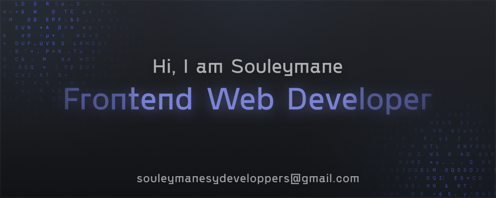

<!-- ============================== -->
<!-- GITHUB PROFILE README -->
<!-- Souleymane Sy (@SouleymaneSy7) -->
<!-- ============================== -->

<!-- Section 1: Custom Banner -->
<p align="center">
  
</p>

<!-- Section 2: Social Badges -->
<p align="center">
  <a href="https://komarev.com/ghpvc/?username=souleymanesy7" target="_blank">
    
  </a>
</p>

<p align="center">
  <a href="https://github.com/SouleymaneSy7?tab=followers" title="GitHub Followers">
    
  </a>
  <a href="https://github.com/SouleymaneSy7?tab=stars" title="GitHub Stars">
    
  </a>
  <a href="mailto:souleymanesycodes@gmail.com" title="Email Me">
    
  </a>
</p>

<!-- Section 3: Typing Animation Intro -->
<p align="center">
  
</p>

---

<!-- Section 4: Hero Introduction -->

## 🌍 About Me

> Coding from Conakry, Guinea — where every commit is a victory over circumstance.

> **Self-taught Frontend Developer** mastering **React, Next.js & TypeScript** in conditions most developers can't imagine: unstable internet that drops during critical learning moments, power outages that erase hours of unsaved progress, and financial barriers that turn every documentation page, every tutorial, every tool into a hard-won treasure. Since 2022, I've transformed these obstacles into my **competitive edge**.

> I don't just write code — **I write proof that geography and wealth don't determine who gets to build the future.** That the next generation of world-class developers won't come from Silicon Valley alone, but from those who refuse to let circumstance write their story. From those who code not because it's convenient, but because they **believe they deserve a seat at the table**.

> **While others debug in comfort, I debug in the dark — literally.** And that makes me **hungrier, sharper and unstoppable**.

> **Building the future, one stubborn commit at a time.**

**🏆 Contest Winner** | **💼 Certified Professional** | **📦 89+ Projects** | **🚀 Available for Remote Work**

---

<!-- Section 5: Achievements & Highlights -->

## 🏆 Achievements & Highlights

| Achievement                       | Details                                                                                                                                                                                          |
| --------------------------------- | ------------------------------------------------------------------------------------------------------------------------------------------------------------------------------------------------ |
| 🥉 **Contest Winner**             | 3rd place Enzo Ustariz Web Development Contest 2024                                                                                                                                              |
| 💼 **Professional Certification** | DevelopersHub Corporation Remote Internship - Exceptional Distinction                                                                                                                            |
| 📦 **89+ Open Source Projects**   | Portfolio demonstrating continuous learning and hands-on experience                                                                                                                              |
| ⭐ **106 GitHub Stars**           | Community recognition across multiple projects                                                                                                                                                   |
| 👥 **370+ Followers**             | Growing network of developers and tech enthusiasts                                                                                                                                               |
| 🌍 **3 Years Self-Taught**        | Intensive learning journey without formal CS education                                                                                                                                           |
| 🎓 **Courses Completed**          | Joy of React (Josh Comeau), TypeScript (AcademindPro, Mosh Hamedani), Next.js (FrontendMasters, Jack Herrington - Pro Next.js Course), GSAP (Creative Coding Club), Framer Motion (Frontend.fyi) |

---

<!-- Section 6: Detailed Profile -->

## 👨🏾‍💻 Full Profile

<details>
<summary>📄 Click to expand full profile details</summary>
<br>

```json
{
  "first_name": "Souleymane",
  "last_name": "Sy",
  "title": "Frontend Web Developer",
  "location": "Conakry, Guinea - Africa",
  "pronouns": ["He", "Him"],
  "education": {
    "path": "Self-taught",
    "description": "Self-directed learning in web development and modern technologies.",
    "since": 2022
  },
  "technologies": {
    "front_end": [
      "HTML5",
      "CSS3",
      "JavaScript (ES6+)",
      "TypeScript",
      "React",
      "Next.js",
      "Vue.js",
      "GSAP",
      "Framer Motion",
      "Sass/SCSS",
      "Tailwind CSS",
      "Markdown",
      "MDX"
    ],
    "tools": [
      "Git",
      "GitHub",
      "VS Code",
      "Neovim",
      "Vim",
      "LazyVim",
      "Figma",
      "Vercel",
      "Pop!_OS",
      "Arch Linux",
      "Hyprland"
    ]
  },
  "ask_me_about": [
    "Web Development",
    "Frontend Frameworks",
    "UI/UX Design",
    "Creative Coding",
    "Linux & Open Source",
    "Tech Trends"
  ],
  "currently_learning": [
    "Node.js & Backend Development",
    "Creative Coding & Advanced Animations",
    "Full-Stack Development"
  ],
  "spoken_languages": ["French (Native)", "English (Professional Proficiency)"],
  "contact": {
    "email": "souleymanesycodes@gmail.com",
    "linkedin": "https://www.linkedin.com/in/souleymanesy7",
    "twitter": "https://twitter.com/souleymanesy43",
    "frontend_mentor": "https://www.frontendmentor.io/profile/SouleymaneSy7",
    "dev_challenges": "https://devchallenges.io/profile/534cd213-3165-4c16-bdcf-058e1f468da0"
  },
  "availability": {
    "status": "Open to opportunities",
    "types": [
      "Remote Full-time",
      "Freelance Projects",
      "Contract Work",
      "Collaborations"
    ]
  }
}
```

</details>

---

<!-- Section 7: Tech Stack Visual -->

## 🛠️ Tech Stack

<details>
<summary>📄 Click to expand Tech Stack details</summary>
<br>

### Frontend Frameworks & Libraries


### Styling & Design


### Animation & Motion


### Tools & Platforms


### Code Editors


### Operating Systems & Environment


</details>

---

<!-- Section 8: Featured Projects -->

## 🎯 Featured Projects

<table>
  <tr>
    <td width="50%">
      <h3 align="center">Fyrre Magazine Website</h3>
      <div align="center">  
        <a href="https://github.com/SouleymaneSy7/fyrre-magazine-website" target="_blank">
          
        </a>
        <br>
        <p>
          <a href="https://github.com/SouleymaneSy7/fyrre-magazine-website" target="_blank">
            
          </a>  
          <a href="https://fyrre-magazine-website.netlify.app/" target="_blank">
            
          </a>
        </p>
        <p><strong>Next.js • TypeScript • MDX • Tailwind CSS</strong></p>
        <p>High-performance magazine platform with 97+ Lighthouse scores</p>
      </div>
    </td>
    <td width="50%">
      <h3 align="center">Conakry Tourism Website 🏆</h3>
      <div align="center">  
        <a href="https://github.com/SouleymaneSy7/conakry-website-challenge" target="_blank">
          
        </a>
        <br>
        <p>
          <a href="https://github.com/SouleymaneSy7/conakry-website-challenge" target="_blank">
            
          </a>  
          <a href="https://conakry-website-challenge-z4t7.vercel.app/" target="_blank">
            
          </a>
        </p>
        <p><strong>React • TypeScript • Sass • GSAP</strong></p>
        <p>🥉 3rd Place - Enzo Ustariz Contest 2024</p>
      </div>
    </td>
  </tr>
  <tr>
    <td width="50%">
      <h3 align="center">Terminal Portfolio Website</h3>
      <div align="center">  
        <a href="https://github.com/SouleymaneSy7/terminal-portfolio-website" target="_blank">
          
        </a>
        <br>
        <p>
          <a href="https://github.com/SouleymaneSy7/terminal-portfolio-website" target="_blank">
            
          </a>  
          <a href="https://terminal-portfolio-website-xi.vercel.app/" target="_blank">
            
          </a>
        </p>
        <p><strong>Next.js • TypeScript • Tailwind CSS</strong></p>
        <p>Interactive CLI-style portfolio with custom commands</p>
      </div>
    </td>
    <td width="50%">
      <h3 align="center">Dictionary Web App</h3>
      <div align="center">  
        <a href="https://github.com/SouleymaneSy7/dictionary-web-app" target="_blank">
          
        </a>
        <br>
        <p>
          <a href="https://github.com/SouleymaneSy7/dictionary-web-app" target="_blank">
            
          </a>  
          <a href="https://dictionary-web-app-seven-olive.vercel.app/" target="_blank">
            
          </a>
        </p>
        <p><strong>Vue.js • Tailwind CSS • API</strong></p>
        <p>Full-featured dictionary with real-time search</p>
      </div>
    </td>
  </tr>
</table>

<p align="center">
  <a href="https://github.com/SouleymaneSy7?tab=repositories" target="_blank">
    
  </a>
</p>

---

<!-- Section 9: Activity Graphs -->

## 🚣🏽‍♂️ GitHub Activity

<p align="center">
  <a href="https://github.com/ashutosh00710/github-readme-activity-graph">
    
  </a>
</p>

### 📊 Coding Activity (This Month)

<!--START_SECTION:waka-->

```typescript
From: 05 January 2026 - To: 03 February 2026

Total Time: 16 hrs 52 mins

Markdown       7 hrs 30 mins   ⣿⣿⣿⣿⣿⣿⣿⣿⣿⣿⣿⣀⣀⣀⣀⣀⣀⣀⣀⣀⣀⣀⣀⣀⣀   44.02 %
TypeScript     3 hrs 7 mins    ⣿⣿⣿⣿⣦⣀⣀⣀⣀⣀⣀⣀⣀⣀⣀⣀⣀⣀⣀⣀⣀⣀⣀⣀⣀   18.31 %
YAML           2 hrs 47 mins   ⣿⣿⣿⣿⣄⣀⣀⣀⣀⣀⣀⣀⣀⣀⣀⣀⣀⣀⣀⣀⣀⣀⣀⣀⣀   16.34 %
CSS            2 hrs 19 mins   ⣿⣿⣿⣤⣀⣀⣀⣀⣀⣀⣀⣀⣀⣀⣀⣀⣀⣀⣀⣀⣀⣀⣀⣀⣀   13.59 %
HTML           26 mins         ⣶⣀⣀⣀⣀⣀⣀⣀⣀⣀⣀⣀⣀⣀⣀⣀⣀⣀⣀⣀⣀⣀⣀⣀⣀   02.62 %
JSON           14 mins         ⣤⣀⣀⣀⣀⣀⣀⣀⣀⣀⣀⣀⣀⣀⣀⣀⣀⣀⣀⣀⣀⣀⣀⣀⣀   01.42 %
Other          11 mins         ⣤⣀⣀⣀⣀⣀⣀⣀⣀⣀⣀⣀⣀⣀⣀⣀⣀⣀⣀⣀⣀⣀⣀⣀⣀   01.13 %
```

<!--END_SECTION:waka-->

---

<!-- Section 10: WakaTime Stats -->

## 📊 Detailed Coding Statistics

<!--START_SECTION:wakatime-readme-stats-->


**🐱 My GitHub Data**

> 📦 259.8 kB Used in GitHub's Storage
>
> 🏆 119 Contributions in the Year 2026
>
> 💼 Opted to Hire
>
> 📜 90 Public Repositories
>
> 🔑 0 Private Repositories
>
> **I'm a Night 🦉**

```text
🌞 Morning                217 commits         ⣿⣿⣀⣀⣀⣀⣀⣀⣀⣀⣀⣀⣀⣀⣀⣀⣀⣀⣀⣀⣀⣀⣀⣀⣀   07.98 %
🌆 Daytime                839 commits         ⣿⣿⣿⣿⣿⣿⣿⣿⣀⣀⣀⣀⣀⣀⣀⣀⣀⣀⣀⣀⣀⣀⣀⣀⣀   30.85 %
🌃 Evening                820 commits         ⣿⣿⣿⣿⣿⣿⣿⣿⣀⣀⣀⣀⣀⣀⣀⣀⣀⣀⣀⣀⣀⣀⣀⣀⣀   30.15 %
🌙 Night                  844 commits         ⣿⣿⣿⣿⣿⣿⣿⣿⣀⣀⣀⣀⣀⣀⣀⣀⣀⣀⣀⣀⣀⣀⣀⣀⣀   31.03 %
```

📅 **I'm Most Productive on Wednesday**

```text
Monday                   399 commits         ⣿⣿⣿⣿⣀⣀⣀⣀⣀⣀⣀⣀⣀⣀⣀⣀⣀⣀⣀⣀⣀⣀⣀⣀⣀   14.67 %
Tuesday                  469 commits         ⣿⣿⣿⣿⣀⣀⣀⣀⣀⣀⣀⣀⣀⣀⣀⣀⣀⣀⣀⣀⣀⣀⣀⣀⣀   17.24 %
Wednesday                564 commits         ⣿⣿⣿⣿⣿⣀⣀⣀⣀⣀⣀⣀⣀⣀⣀⣀⣀⣀⣀⣀⣀⣀⣀⣀⣀   20.74 %
Thursday                 397 commits         ⣿⣿⣿⣿⣀⣀⣀⣀⣀⣀⣀⣀⣀⣀⣀⣀⣀⣀⣀⣀⣀⣀⣀⣀⣀   14.60 %
Friday                   402 commits         ⣿⣿⣿⣿⣀⣀⣀⣀⣀⣀⣀⣀⣀⣀⣀⣀⣀⣀⣀⣀⣀⣀⣀⣀⣀   14.78 %
Saturday                 295 commits         ⣿⣿⣿⣀⣀⣀⣀⣀⣀⣀⣀⣀⣀⣀⣀⣀⣀⣀⣀⣀⣀⣀⣀⣀⣀   10.85 %
Sunday                   194 commits         ⣿⣿⣀⣀⣀⣀⣀⣀⣀⣀⣀⣀⣀⣀⣀⣀⣀⣀⣀⣀⣀⣀⣀⣀⣀   07.13 %
```

📊 **This Week I Spent My Time On**

```text
🕑︎ Time Zone: Africa/Conakry

💬 Programming Languages:
Markdown                 3 hrs 25 mins       ⣿⣿⣿⣿⣿⣿⣿⣿⣿⣿⣀⣀⣀⣀⣀⣀⣀⣀⣀⣀⣀⣀⣀⣀⣀   40.12 %
YAML                     2 hrs 47 mins       ⣿⣿⣿⣿⣿⣿⣿⣿⣀⣀⣀⣀⣀⣀⣀⣀⣀⣀⣀⣀⣀⣀⣀⣀⣀   32.76 %
CSS                      55 mins             ⣿⣿⣿⣀⣀⣀⣀⣀⣀⣀⣀⣀⣀⣀⣀⣀⣀⣀⣀⣀⣀⣀⣀⣀⣀   10.91 %
TypeScript               37 mins             ⣿⣿⣀⣀⣀⣀⣀⣀⣀⣀⣀⣀⣀⣀⣀⣀⣀⣀⣀⣀⣀⣀⣀⣀⣀   07.36 %
HTML                     26 mins             ⣿⣀⣀⣀⣀⣀⣀⣀⣀⣀⣀⣀⣀⣀⣀⣀⣀⣀⣀⣀⣀⣀⣀⣀⣀   05.25 %

🔥 Editors:
Neovim                   7 hrs 15 mins       ⣿⣿⣿⣿⣿⣿⣿⣿⣿⣿⣿⣿⣿⣿⣿⣿⣿⣿⣿⣿⣿⣀⣀⣀⣀   85.24 %
VS Code                  1 hr 15 mins        ⣿⣿⣿⣿⣀⣀⣀⣀⣀⣀⣀⣀⣀⣀⣀⣀⣀⣀⣀⣀⣀⣀⣀⣀⣀   14.76 %

🐱‍💻 Projects:
SouleymaneSy7            6 hrs 1 min         ⣿⣿⣿⣿⣿⣿⣿⣿⣿⣿⣿⣿⣿⣿⣿⣿⣿⣿⣀⣀⣀⣀⣀⣀⣀   70.78 %
typing-speed-test-web-app2 hrs 17 mins       ⣿⣿⣿⣿⣿⣿⣿⣀⣀⣀⣀⣀⣀⣀⣀⣀⣀⣀⣀⣀⣀⣀⣀⣀⣀   26.94 %
Unknown Project          6 mins              ⣀⣀⣀⣀⣀⣀⣀⣀⣀⣀⣀⣀⣀⣀⣀⣀⣀⣀⣀⣀⣀⣀⣀⣀⣀   01.21 %
utilisateur              5 mins              ⣀⣀⣀⣀⣀⣀⣀⣀⣀⣀⣀⣀⣀⣀⣀⣀⣀⣀⣀⣀⣀⣀⣀⣀⣀   01.07 %

💻 Operating System:
Linux                    7 hrs 15 mins       ⣿⣿⣿⣿⣿⣿⣿⣿⣿⣿⣿⣿⣿⣿⣿⣿⣿⣿⣿⣿⣿⣀⣀⣀⣀   85.24 %
Windows                  1 hr 15 mins        ⣿⣿⣿⣿⣀⣀⣀⣀⣀⣀⣀⣀⣀⣀⣀⣀⣀⣀⣀⣀⣀⣀⣀⣀⣀   14.76 %
```

**I Mostly Code in SCSS**

```text
SCSS                     35 repos            ⣿⣿⣿⣿⣿⣿⣿⣿⣿⣿⣿⣀⣀⣀⣀⣀⣀⣀⣀⣀⣀⣀⣀⣀⣀   43.75 %
TypeScript               17 repos            ⣿⣿⣿⣿⣿⣀⣀⣀⣀⣀⣀⣀⣀⣀⣀⣀⣀⣀⣀⣀⣀⣀⣀⣀⣀   21.25 %
Vue                      10 repos            ⣿⣿⣿⣀⣀⣀⣀⣀⣀⣀⣀⣀⣀⣀⣀⣀⣀⣀⣀⣀⣀⣀⣀⣀⣀   12.50 %
JavaScript               2 repos             ⣿⣀⣀⣀⣀⣀⣀⣀⣀⣀⣀⣀⣀⣀⣀⣀⣀⣀⣀⣀⣀⣀⣀⣀⣀   02.50 %
Lua                      1 repo              ⣀⣀⣀⣀⣀⣀⣀⣀⣀⣀⣀⣀⣀⣀⣀⣀⣀⣀⣀⣀⣀⣀⣀⣀⣀   01.25 %
```

<!--END_SECTION:wakatime-readme-stats-->

---

<!-- Section 11: GitHub Stats -->

## 📈 GitHub Statistics

### 🏆 GitHub Trophies

<p align="center">
  
</p>

### 📊 Profile Summary Cards

<p align="center">
  
  
  
  
</p>

### ⏰ Productive Time & Language Stats

<p align="center">
  
  
</p>

### 🔥 Contribution Streak

<p align="center">
  <a href="https://git.io/streak-stats"></a>
</p>

---

<!-- Section 12: Recent Activity -->

### 🕓 Recent GitHub Activity

<details>
<summary>📄 Click to expand Recent Github Activity details</summary>
<br>

<!--START_SECTION:activity-->

<!--END_SECTION:activity-->

</details>

---

<!-- Section 13: Random Dev Quote -->

## 💭 Dev Quote of the Day

<p align="center">
  <a href="https://github.com/PiyushSuthar/github-readme-quotes">
    
  </a>
</p>

---

<!-- Section 14: Connect & Support -->

## 💬 Let's Connect!

### 🤝 I'm Open To

- 💼 **Remote frontend development opportunities**
- 🎯 **Freelance web development projects**
- 🤝 **Open source collaborations**
- 📧 **Tech discussions and mentorship**

### 📫 Reach Out

<a href="mailto:souleymanesycodes@gmail.com">
  
</a>
<a href="https://www.linkedin.com/in/souleymanesy7" target="_blank">
  
</a>
<a href="https://twitter.com/souleymanesy43" target="_blank">
  
</a>

### 💻 Coding Challenges & Community

<a href="https://www.frontendmentor.io/profile/SouleymaneSy7" target="_blank">  </a> <a href="https://devchallenges.io/profile/534cd213-3165-4c16-bdcf-058e1f468da0" target="_blank">  </a> </div>

---

<!-- Footer -->

### ⭐ Support My Work

If you find my projects helpful, consider:

- ⭐ Starring my repositories
- 🐛 Reporting bugs or suggesting features
- 💬 Sharing my work with others

<p align="center">
  <a href="https://github.com/SouleymaneSy7?tab=repositories&sort=stargazers">
    
  </a>
</p>

---

<div align="center">
  
**⭐ From [SouleymaneSy7](https://github.com/SouleymaneSy7) | Made with ❤️ in Conakry, Guinea 🇬🇳**

_Last updated: Auto-updated every 6 hours via GitHub Actions_

</div>
